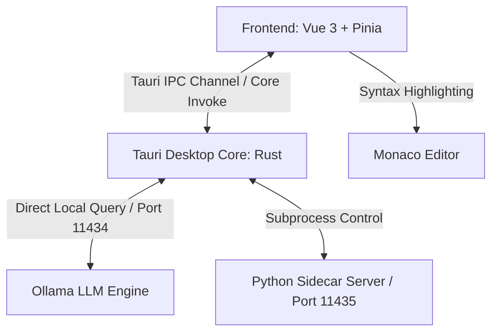

# ❄️ Nordic IDE

A high-performance, premium AI-native code editor crafted with a clean **Nordic aesthetic**, built on **Vue 3**, **TypeScript**, **Tauri v2**, **Monaco Editor**, and **Ollama**.

Designed for developers who prioritize visual excellence, high performance, and absolute privacy. Every feature runs entirely on your local machine.

---

## ✨ Features & Architecture

### 🎨 Visual & Theme System

- **Nordic Vivid Theme**: Custom Monaco editor theme inspired by _Catppuccin Mocha_, tuned for high readability with a specific 5-hue palette mapping.
- **Material Icon Theme Integration**: Dynamically loads real, official file-type SVGs in the File Tree and Editor Tabs, matching modern VS Code standards.
- **Premium UX Details**: Custom styled compact tab Close buttons (`×`), pulse dirty-state indicators, smooth micro-animations, and glassmorphic panels.

### ⚡ AI Assistant (Ollama Powered)

- **Real-time Streaming Chat**: Incremental token streaming using Tauri v2 Channels, bypassing standard synchronous request latency for instananeous replies.
- **Direct Ollama Integration**: Fully asynchronous chunk stream parsed and rendered in markdown in real-time.
- **Markdown-It Integration**: Custom parser rendering codeblocks, auto-injecting:
  - `▶ Run in Terminal` buttons for shell commands.
  - `✅ Apply` buttons for code snippets directly into the active editor.
- **Selection Assistant Grid**: Quick actions executing contextual prompts on selected editor code blocks:
  - 💡 **Explain**: Step-by-step description of selected code logic.
  - 🐛 **Fix Bugs**: Deep diagnostic and fix recommendations for syntax/logic bugs.
  - 🧹 **Refactor**: Clean, simplify, and polish code structure to idiomatic forms.
  - ⚡ **Optimize**: Speed up execution, lower complexity, and optimize memory usage.
  - 🧪 **Write Tests**: Automatically construct unit tests based on selection.
  - 📝 **Document**: Generate premium inline documentation (JSDocs, Rust docs, Python docstrings).
  - 📋 **Checklist PLAN**: Generate implementation checklists for your current task context.

### 🛠️ Developer Productivity Tools

- **Prettier Standalone Formatter**: Built-in multi-language code formatter accessible via a Status Bar button (`✨`) and the `Ctrl+Shift+F` hotkey.
- **Active Context Syncing**: Automatic language detection supporting 20+ file formats (Rust, Go, Python, Vue, TS, C++, and more) to guarantee instant syntax coloring and language features.
- **Local Terminal Control**: Integration for terminal execution and instant command piping from codeblock suggestions.

---

## 🏛️ Architecture & Tech Stack



- **Frontend**: Vue 3 (Composition API), Pinia (State Management), Tailwind CSS v4.
- **Desktop Shell**: Tauri v2 (Rust) providing filesystem access, git status utilities, and process managers.
- **Formatting Engine**: Standalone Prettier parser bundle.
- **AI Model Engine**: Local Ollama server (`deepseek-coder`, `qwen2.5-coder`, or similar).

---

## 📂 Project Structure

```text
ai-editor/
├── src/                      # Vue 3 Frontend Workspace
│   ├── app/                  # Application State & Configuration
│   │   ├── router/           # Routing definitions
│   │   └── stores/           # Pinia stores (editor, AI, terminal, explorer)
│   ├── components/           # Reusable UI components
│   │   ├── ai/               # AI Chat & Selection Assistant
│   │   ├── editor/           # Monaco Editor & Document Tab Bar
│   │   ├── layout/           # Sidebar layout & Status Bar
│   │   └── sidebar/          # File explorer tree
│   ├── services/             # Core TypeScript APIs
│   │   ├── ai.ts             # Channel IPC connection
│   │   ├── formatter.ts      # Standalone Prettier
│   │   └── language.ts       # Language detector
│   └── main.ts               # Frontend entrypoint
├── src-tauri/                # Tauri Desktop Backend
│   ├── src/
│   │   ├── lib.rs            # Tauri Rust commands (filesystem, git, stream)
│   │   └── main.rs           # Core entrypoint
│   └── Cargo.toml            # Rust packages & capabilities
└── src-python/               # Python Utility Sidecar Process
    └── main.py               # Autocomplete & background service helper
```

---

## 🚀 Getting Started

### Prerequisites

1. **Rust & Tauri Tools**: Install Rust via [rustup](https://rustup.rs/) (Tauri v2 requires Rust 1.77.2+).
2. **NodeJS**: Version 18+ recommended.
3. **Python**: Python 3.8+ for utility sidecars.
4. **Ollama**: Download and install [Ollama](https://ollama.com).

### Installation & Run

1. **Clone the repository**:

   ```bash
   git clone https://github.com/saiyaner/ai-editor.git
   cd ai-editor
   ```

2. **Install frontend dependencies**:

   ```bash
   npm install
   ```

3. **Start local AI Engine (Ollama)**:
   Ensure Ollama is running, then pull your preferred coding model:

   ```bash
   ollama pull qwen2.5-coder:3b
   ```

4. **Run in development mode**:

   ```bash
   npm run tauri dev
   ```

5. **Build production app**:
   ```bash
   npm run tauri build
   ```

---

## ⌨️ Shortcuts & Hotkeys

| Shortcut            | Action                                 |
| ------------------- | -------------------------------------- |
| `Ctrl + S`          | Save Active Document                   |
| `Ctrl + Shift + F`  | Format Code with Prettier              |
| `@` in Chat Input   | Mention files to include in AI Context |
| `Double Click File` | Open in Monaco editor                  |

---

## 🛡️ License

Distributed under the **MIT License**. See `LICENSE` for more information.
